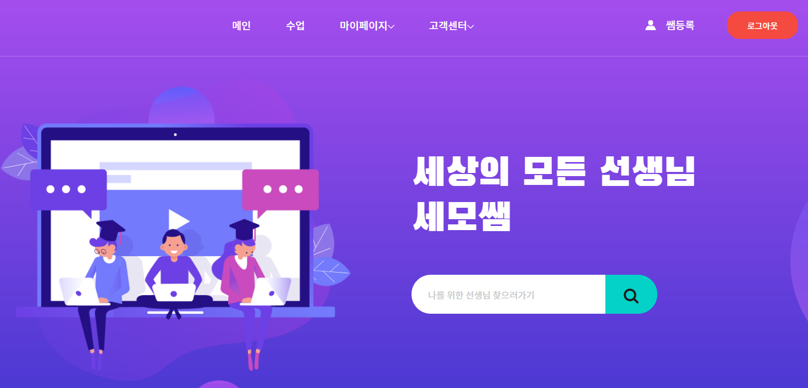
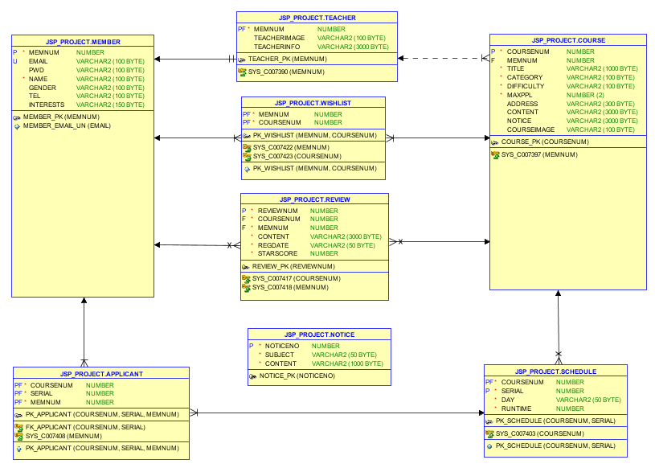

# semosam
재능 공유 플랫폼
- 기간 : 20. 08. 15 ~ 20. 08. 29
- 팀원 : 4명

&nbsp;&nbsp;&nbsp;

# Technologies
 - Java, JavaScript
 - Oracle DB

&nbsp;&nbsp;&nbsp;

# DB Modeling

User Tables

#### MEMBER
  - 일반 사용자 정보를 저장합니다.

 
#### TEACHER
 - 일반 사용자 중 쌤등록을 한 사용자 정보를 저장합니다.

&nbsp;&nbsp;&nbsp;

Course Tables

#### COURSE
 - 쌤이 등록한 수업 정보를 저장합니다.

#### SCHEDULE
 - 수업의 상세일정을 저장합니다.

&nbsp;&nbsp;&nbsp;

Relational Tables

#### APPLICANT
 - 사용자가 수강 신청한 수업의 일정을 저장합니다.

#### WISHLIST
 - 사용자가 찜한 수업 정보를 저장합니다.

#### REVIEW
 - 사용자가 수강 후 남긴 리뷰를 저장합니다.

&nbsp;&nbsp;&nbsp;

Other Tables

#### NOTICE
 - 공지사항 내용을 저장합니다.

